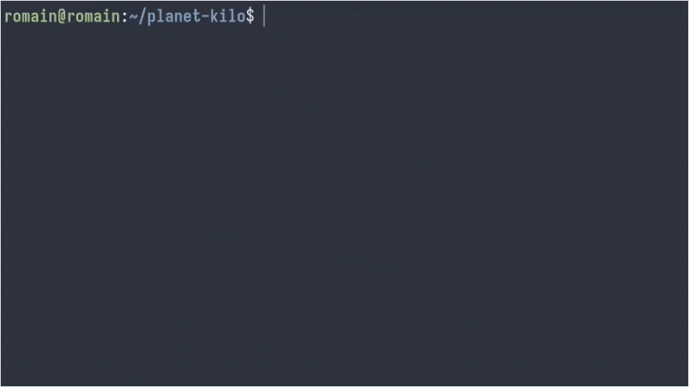

## Port of the Kilo text editor to planet

This is a port of the [antirez/kilo](https://github.com/antirez/kilo) text editor to `planet`.  
<!---->
[planet](https://github.com/romainducrocq/planet) is a C-like programming language based on my C compiler [wheelcc](https://github.com/romainducrocq/wheelcc), written in C from scratch for GNU/Linux, MacOS and FreeBSD. It compiles programs to native x86-64 assembly and uses the C standard library at runtime. I'm using Kilo to test my language on a "relatively" large program (> 1500 loc).  
<!---->
This port has been extended to support syntax highlighting for both `planet` and C/C++, but is otherwise faithfull to the original implementation so that the sources can be easily compared (that said, it also fixes a few bugs and segfaults). `planet-kilo` works on Linux and FreeBSD, but not aarch64 MacOS. Try it out: `HELP: Ctrl-S = save | Ctrl-Q = quit | Ctrl-F = find`  

### Quick install

See the repo of the language for more info, or get started now:  
```
$ git clone --depth 1 --branch master --recurse-submodules --shallow-submodules https://github.com/romainducrocq/planet
$ cd planet/bin/
$ ./configure.sh
$ ./make.sh
$ ./install.sh
$ . ~/.bashrc # or . ~/.zshrc or . ~/.shrc
```

### Build and Run

Build with the `planet` compiler  
```
planet -O3 -E -latexit -lsignal kilo.plx
```
and start your coding session :coffee:  
```
./kilo <filename>
```

  

****

@romainducrocq
